# Orquestrador "Magro" para Cursor, Gemini CLI e Codex CLI

Um orquestrador determinístico e auditável para encadear o ciclo: **Planner (Gemini) → Coder (Codex) → Integrator/Runner (Cursor) → Tester → Reporter**.

## 🎯 Objetivo

Encadear, de forma determinística e auditável, o ciclo completo de desenvolvimento com um comando único. Artefatos padronizados evitam retrabalho e facilitam auditoria.

## 🏗️ Arquitetura

```mermaid
graph LR
    A[Issues/*.md] --> B[Planner<br/>Gemini CLI]
    B --> C[plan.json<br/>spec.md]
    C --> D[Coder<br/>Codex CLI]
    D --> E[Code + Tests]
    E --> F[Integrator<br/>Cursor CLI]
    F --> G[Build + Smoke Tests]
    G --> H[Tester<br/>Canônico]
    H --> I[qa.json]
    I --> J[Gate Manual]
    J --> K[Merge]
```



## 📁 Estrutura de Diretórios

```
/issues/           ← solicitações em Markdown (uma por tarefa)
/handoff/          ← contratos entre etapas (plan.json, spec.md)
/src/, /tests/     ← código e testes produzidos
/reports/          ← qa.json, métricas, artefatos de teste
/logs/             ← execução por etapa, stdout/stderr
/diffs/            ← patches gerados/aplicados
/.cursor/          ← rules e presets do Cursor
/orchestrator/     ← configs do pipeline
/secrets/          ← .env.example (nunca subir .env real)
```

## 🚀 Instalação

1. **Clone o repositório:**
   ```bash
   git clone <repository-url>
   cd Maestro
   ```

2. **Configure as CLIs:**
   ```bash
   # Instalar Gemini CLI
   # Instalar Codex CLI  
   # Instalar Cursor CLI
   ```

3. **Configure secrets:**
   ```bash
   cp secrets/env.example secrets/.env
   # Editar secrets/.env com suas chaves
   ```

4. **Configure permissões:**
   ```bash
   chmod +x orchestrator/orchestrate.sh
   chmod +x orchestrator/write_qa.py
   ```

## 📖 Uso

### Comando Único (Recomendado)

```bash
# Executar pipeline completo
./orchestrator/orchestrate.sh demo

# Ou usando Makefile
make TASK=demo all
```

### Etapas Individuais

```bash
# 1. Planejamento
make TASK=demo plan

# 2. Geração de código
make TASK=demo code

# 3. Integração
make TASK=demo integrate

# 4. Testes
make TASK=demo test

# 5. Relatório
make TASK=demo report
```

### Criar Nova Task

```bash
# Copiar template
cp issues/TEMPLATE.md issues/minha-task.md

# Editar issue
vim issues/minha-task.md

# Executar pipeline
./orchestrator/orchestrate.sh minha-task
```

## 📋 Contratos

### `handoff/plan.json`
Contrato entre Planner e Coder com:
- `task_id`, `goal`, `context`
- `deliverables`, `apis_or_sdks`
- `acceptance_criteria`, `test_plan`
- `files_to_touch`, `telemetry`

### `handoff/spec.md`
Descrição humana da arquitetura proposta:
- Diagramas em texto
- Pseudocódigo essencial
- Decisões e trade-offs

### `reports/qa.json`
Relatório consolidado com:
- `tests_run`, `passed`, `failed`
- `coverage`, `lint_errors`, `type_errors`
- `status`, `next_actions`
- `timestamp_start`, `timestamp_end`

## ⚙️ Configuração

### Timeouts (segundos)
- **Planner**: 120s
- **Coder**: 300s  
- **Tester**: 600s
- **Integrator**: 180s

### Limites
- **Diff máximo**: 1.000 linhas
- **Cobertura mínima**: 70%
- **Erros de lint**: 0
- **Erros de tipo**: 0

### Políticas
- **Fail fast**: Falha em qualquer etapa aborta subsequentes
- **Gate manual**: Aprovação manual antes do merge
- **Idempotência**: Reexecução substitui artefatos do mesmo task_id
- **Sanitização**: Logs não contêm secrets

## 🔍 Observabilidade

### Logs
Cada etapa escreve logs em `logs/<task_id>.<stage>.log`:
- Comando invocado e argumentos
- Timestamps de início/fim
- Código de retorno
- Resumo de stdout/stderr

### Métricas
- Tempo por etapa
- Número de arquivos tocados
- Tamanho do diff
- Contagem de testes
- Cobertura de código

### Status
```bash
# Verificar status atual
make TASK=demo status

# Ver logs de uma etapa
cat logs/demo.plan.log
cat logs/demo.test.out
```

## 🛡️ Segurança

- **Secrets**: Nunca subir `.env` real
- **Sanitização**: Logs não contêm chaves ou headers de auth
- **Permissões**: Sem permissões de saque em chaves do app
- **Retenção**: Limpar logs sensíveis conforme política

## 🧪 Testes

### Suíte Canônica
1. **Linting**: `ruff check .`
2. **Type checking**: `mypy src`
3. **Unit/Integration**: `pytest -q --cov=src`

### Testes de Fumaça
- Build local: `pip install -e .`
- Testes rápidos: `pytest -q tests/smoke`

## 🔧 Comandos Úteis

```bash
# Limpar artefatos
make clean

# Criar issue de exemplo
make create-demo

# Verificar status
make status

# Ver ajuda
make help
```

## 📊 KPIs

- **Taxa de "pass"** na primeira execução
- **Tempo médio** por etapa
- **Tamanho médio** de diffs
- **Retries** por semana
- **Incidentes** de violação de files_to_touch (esperado = 0)

## 🚧 Roadmap

- [ ] Watcher por arquivo em `/issues/` para disparo automático
- [ ] Paralelismo para múltiplos task_id
- [ ] Feedback loop: Tester → Planner com qa.next_actions automático
- [ ] Relatórios HTML agregados em `/reports/summary.html`
- [ ] Hooks opcionais para CI remoto

## 🤝 Contribuição

1. Fork o projeto
2. Crie uma branch para sua feature (`git checkout -b feature/AmazingFeature`)
3. Commit suas mudanças (`git commit -m 'Add some AmazingFeature'`)
4. Push para a branch (`git push origin feature/AmazingFeature`)
5. Abra um Pull Request

## 📄 Licença

Este projeto está licenciado sob a Licença MIT - veja o arquivo [LICENSE](LICENSE) para detalhes.

## 🆘 Suporte

- **Issues**: Abra uma issue no GitHub
- **Documentação**: Veja os arquivos em `/docs/`
- **Exemplos**: Veja `/issues/demo.md` para um exemplo completo

---

**Desenvolvido com ❤️ para automatizar o desenvolvimento com Cursor, Gemini CLI e Codex CLI**
