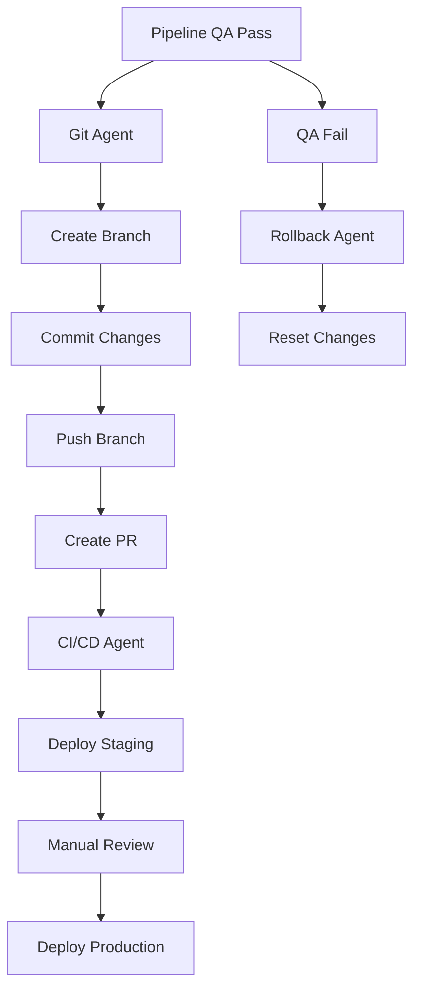

# Automação Git/CI-CD - Orquestrador Maestro

## Visão Geral

O sistema de automação Git/CI-CD integrado ao Orquestrador Maestro automatiza commits, push e deploy quando o QA passa, mantendo controle e segurança.

## Arquitetura



## Componentes

### 1. Git Agent (`src/maestro/git_agent.py`)

**Responsabilidades:**
- Detectar QA pass em `reports/qa.json`
- Criar branch feature/ automaticamente
- Fazer commit das mudanças
- Push para repositório remoto
- Criar Pull Request

**Uso:**
```bash
# Executar git agent
poetry run python src/maestro/git_agent.py <task_id>

# Ou via orquestrador
make TASK=<task_id> git-automation
```

### 2. CI/CD Agent (`src/maestro/ci_cd_agent.py`)

**Responsabilidades:**
- Gerenciar deploy em staging
- Monitorar status de deploy
- Executar rollback quando necessário
- Integrar com GitHub Actions

**Uso:**
```bash
# Deploy staging
poetry run python src/maestro/ci_cd_agent.py deploy-staging <task_id>

# Deploy production
poetry run python src/maestro/ci_cd_agent.py deploy-production <task_id>

# Rollback
poetry run python src/maestro/ci_cd_agent.py rollback <task_id>
```

### 3. Configuração (`config/git-automation.json`)

```json
{
  "git": {
    "auto_commit": true,
    "auto_push": true,
    "auto_pr": true,
    "branch_prefix": "feature/",
    "commit_message_template": "feat: {task_id} - {description}",
    "max_commit_size": 200,
    "allowed_paths": ["src/maestro/**", ".github/workflows/**", "config/**"],
    "exclude_patterns": ["*.env", "secrets/*", "*.key", "*.log", "*.tmp"]
  },
  "ci_cd": {
    "auto_deploy_staging": true,
    "auto_deploy_production": false,
    "staging_environment": "staging",
    "production_environment": "production",
    "rollback_on_failure": true,
    "deploy_timeout": 300,
    "github_actions_workflow": "maestro-automation.yml"
  },
  "security": {
    "require_manual_approval": true,
    "exclude_secrets": true,
    "exclude_patterns": ["*.env", "secrets/*", "*.key"],
    "max_diff_lines": 1000,
    "require_qa_pass": true
  },
  "logging": {
    "log_level": "INFO",
    "log_file": "logs/git-automation.log",
    "structured_logging": true,
    "retention_days": 30
  }
}
```

### 4. GitHub Actions Workflow (`.github/workflows/maestro-automation.yml`)

Workflow que integra com os agentes para:
- Deploy automático em staging
- Deploy em produção com aprovação manual
- Rollback automático em caso de falha

## Fluxo de Execução

### 1. Detecção de QA Pass
```python
# Git Agent detecta QA pass
qa_status = git_agent.check_qa_status(task_id)
if qa_status == "pass":
    git_agent.auto_commit_and_push(task_id)
```

### 2. Commit Automático
```python
# Criar branch e fazer commit
branch_name = git_agent.create_feature_branch(task_id)
git_agent.commit_changes(task_id, f"feat: {task_id} - {description}")
git_agent.push_branch(branch_name)
```

### 3. Criação de PR
```python
# Criar Pull Request automaticamente
pr_url = git_agent.create_pull_request(task_id, branch_name)
```

### 4. Deploy Staging
```python
# Deploy automático em staging
ci_cd_agent.deploy_staging(task_id, branch_name)
```

### 5. Rollback em Caso de Falha
```python
# Rollback automático se QA falhar
if qa_status == "fail":
    git_agent.rollback_changes(task_id)
    ci_cd_agent.rollback_deploy(task_id)
```

## Integração com Orquestrador

### Modificação do `orchestrate.sh`
```bash
# Adicionar ao final do pipeline
if [[ "$QA_STATUS" == "pass" ]]; then
    echo "🚀 QA Pass - Iniciando automação git/CI-CD"
    poetry run python -m src.maestro.git_agent "$TASK"
    poetry run python -m src.maestro.ci_cd_agent "deploy-staging" "$TASK"
fi
```

## Segurança

### Gates de Segurança
1. **Manual Approval**: Deploy em produção requer aprovação manual
2. **Secret Protection**: Nunca commitar secrets ou arquivos sensíveis
3. **Path Restrictions**: Apenas paths permitidos podem ser modificados
4. **Size Limits**: Limite de tamanho para commits
5. **Rollback Capability**: Rollback automático em caso de falha

### Validações
```python
def validate_changes(task_id: str) -> bool:
    # Verificar se há secrets nos arquivos
    # Verificar se paths estão permitidos
    # Verificar tamanho do diff
    # Verificar se não há arquivos sensíveis
    pass
```

## Logs e Monitoramento

### Estrutura de Logs
```python
# Logs estruturados para todas operações
{
    "timestamp": "2025-08-31T02:18:57-0300",
    "task_id": "git-automation",
    "operation": "commit",
    "status": "success",
    "branch": "feature/git-automation",
    "commit_hash": "abc123",
    "files_changed": 5,
    "lines_added": 150,
    "lines_removed": 10
}
```

### Monitoramento
```bash
# Ver logs de git automation
tail -f logs/git-automation.log

# Ver logs de CI/CD
tail -f logs/ci-cd-automation.log

# Verificar status via API
curl http://localhost:8000/api/git-automation
```

## Testes

### Executar Testes
```bash
# Testes unitários
poetry run pytest tests/test_git_automation.py -v

# Testes de integração
poetry run pytest tests/test_git_automation.py::TestIntegration -v

# Cobertura
poetry run pytest tests/test_git_automation.py --cov=src.maestro --cov-report=html
```

### Cenários de Teste
- QA pass → commit automático → deploy staging
- QA fail → rollback automático
- Validação de secrets
- Validação de paths permitidos
- Rollback de deploy

## Configuração

### Habilitar/Desabilitar Funcionalidades
```json
{
  "git": {
    "auto_commit": true,      // Habilitar commit automático
    "auto_push": true,        // Habilitar push automático
    "auto_pr": true           // Habilitar criação de PR
  },
  "ci_cd": {
    "auto_deploy_staging": true,     // Habilitar deploy staging
    "auto_deploy_production": false  // Desabilitar deploy produção
  }
}
```

### Configurar Timeouts
```json
{
  "ci_cd": {
    "deploy_timeout": 300  // Timeout de deploy em segundos
  }
}
```

### Configurar Limites
```json
{
  "security": {
    "max_diff_lines": 1000  // Máximo de linhas por commit
  },
  "git": {
    "max_commit_size": 200   // Máximo de arquivos por commit
  }
}
```

## Troubleshooting

### Problemas Comuns

**Erro: "QA report not found"**
```bash
# Verificar se QA report existe
ls reports/qa.json

# Verificar se pipeline foi executado
make TASK=<task_id> status
```

**Erro: "GitHub CLI not available"**
```bash
# Instalar GitHub CLI
brew install gh

# Configurar autenticação
gh auth login
```

**Erro: "Branch already exists"**
```bash
# Verificar branches existentes
git branch -a

# Deletar branch se necessário
git branch -D feature/<task_id>
```

**Erro: "Deploy timeout"**
```bash
# Aumentar timeout no config
vim config/git-automation.json

# Verificar logs de deploy
tail -f logs/ci-cd-automation.log
```

### Debug
```bash
# Executar com debug
DEBUG=1 poetry run python src/maestro/git_agent.py <task_id>

# Ver logs detalhados
tail -f logs/git-automation.log

# Verificar configuração
cat config/git-automation.json | jq .
```

## Casos de Uso

### Caso 1: Feature Completa
1. Criar issue em `issues/feature.md`
2. Executar pipeline: `make TASK=feature all`
3. QA passa automaticamente
4. Git Agent cria branch e faz commit
5. CI/CD Agent faz deploy em staging
6. Manual review e merge

### Caso 2: Bug Fix
1. Criar issue em `issues/bugfix.md`
2. Executar pipeline: `make TASK=bugfix all`
3. QA passa automaticamente
4. Git Agent cria PR
5. Deploy automático em staging
6. Testes em staging passam
7. Deploy em produção com aprovação

### Caso 3: Rollback
1. QA falha no pipeline
2. Rollback automático é executado
3. Mudanças são resetadas
4. Deploy é revertido
5. Notificação é enviada

## Próximos Passos

1. **Integrar com Slack/Teams** para notificações
2. **Adicionar métricas** de sucesso/falha
3. **Implementar deploy blue-green** para zero downtime
4. **Adicionar testes de smoke** em staging
5. **Implementar feature flags** para deploy gradual

## Contribuição

Para contribuir com a automação git/CI-CD:

1. Criar issue descrevendo a feature
2. Implementar seguindo padrões existentes
3. Adicionar testes unitários
4. Atualizar documentação
5. Submeter PR para review
