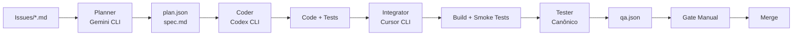

# Orquestrador "Magro" para Cursor, Gemini CLI e Codex CLI

Um orquestrador determinístico e auditável para encadear o ciclo: **Planner (Gemini) → Coder (Codex) → Integrator/Runner (Cursor) → Tester → Reporter**.

## 🎯 Objetivo

Encadear, de forma determinística e auditável, o ciclo completo de desenvolvimento com um comando único. Artefatos padronizados evitam retrabalho e facilitam auditoria.

## 🏗️ Arquitetura



## 📁 Estrutura de Diretórios

```
/issues/           ← solicitações em Markdown (uma por tarefa)
/handoff/          ← contratos entre etapas (plan.json, spec.md)
/src/, /tests/     ← código e testes produzidos
/reports/          ← qa.json, métricas, artefatos de teste
/logs/             ← execução por etapa, stdout/stderr
/diffs/            ← patches gerados/aplicados
/.cursor/          ← rules e presets do Cursor
/orchestrator/     ← configs do pipeline
/secrets/          ← .env.example (nunca subir .env real)
```

## 🚀 Instalação

1. **Clone o repositório:**
   ```bash
   git clone <repository-url>
   cd Maestro
   ```

2. **Instale o Poetry (se não tiver):**
   ```bash
   curl -sSL https://install.python-poetry.org | python3 -
   ```

3. **Instale as dependências Python:**
   ```bash
   poetry install
   ```

4. **Configure as CLIs:**
   ```bash
   # Instalar Gemini CLI
   # Instalar Codex CLI  
   # Instalar Cursor CLI
   ```

5. **Configure secrets:**
   ```bash
   cp secrets/env.example secrets/.env
   # Editar secrets/.env com suas chaves
   ```

6. **Configure permissões:**
   ```bash
   chmod +x orchestrator/orchestrate.sh
   chmod +x orchestrator/write_qa.py
   chmod +x scripts/dev.sh
   ```

## 📖 Uso

### Comando Único (Recomendado)

```bash
# Executar pipeline completo
./orchestrator/orchestrate.sh demo

# Ou usando Makefile
make TASK=demo all
```

### Etapas Individuais

```bash
# 1. Planejamento
make TASK=demo plan

# 2. Geração de código
make TASK=demo code

# 3. Integração
make TASK=demo integrate

# 4. Testes
make TASK=demo test

# 5. Relatório
make TASK=demo report
```

### Criar Nova Task

```bash
# Copiar template
cp issues/TEMPLATE.md issues/minha-task.md

# Editar issue
vim issues/minha-task.md

# Executar pipeline
./orchestrator/orchestrate.sh minha-task
```

## 📋 Contratos

### `handoff/plan.json`
Contrato entre Planner e Coder com:
- `task_id`, `goal`, `context`
- `deliverables`, `apis_or_sdks`
- `acceptance_criteria`, `test_plan`
- `files_to_touch`, `telemetry`

### `handoff/spec.md`
Descrição humana da arquitetura proposta:
- Diagramas em texto
- Pseudocódigo essencial
- Decisões e trade-offs

### `reports/qa.json`
Relatório consolidado com:
- `tests_run`, `passed`, `failed`
- `coverage`, `lint_errors`, `type_errors`
- `status`, `next_actions`
- `timestamp_start`, `timestamp_end`

## ⚙️ Configuração

### Timeouts (segundos)
- **Planner**: 120s
- **Coder**: 300s  
- **Tester**: 600s
- **Integrator**: 180s

### Limites
- **Diff máximo**: 1.000 linhas
- **Cobertura mínima**: 70%
- **Erros de lint**: 0
- **Erros de tipo**: 0

### Políticas
- **Fail fast**: Falha em qualquer etapa aborta subsequentes
- **Gate manual**: Aprovação manual antes do merge
- **Idempotência**: Reexecução substitui artefatos do mesmo task_id
- **Sanitização**: Logs não contêm secrets

## 🔍 Observabilidade

### Logs
Cada etapa escreve logs em `logs/<task_id>.<stage>.log`:
- Comando invocado e argumentos
- Timestamps de início/fim
- Código de retorno
- Resumo de stdout/stderr

### Métricas
- Tempo por etapa
- Número de arquivos tocados
- Tamanho do diff
- Contagem de testes
- Cobertura de código

### Status
```bash
# Verificar status atual
make TASK=demo status

# Ver logs de uma etapa
cat logs/demo.plan.log
cat logs/demo.test.out
```

## 🛡️ Segurança

- **Secrets**: Nunca subir `.env` real
- **Sanitização**: Logs não contêm chaves ou headers de auth
- **Permissões**: Sem permissões de saque em chaves do app
- **Retenção**: Limpar logs sensíveis conforme política

## 🧪 Testes

### Suíte Canônica
1. **Linting**: `ruff check .`
2. **Type checking**: `mypy src`
3. **Unit/Integration**: `pytest -q --cov=src`

### Testes de Fumaça
- Build local: `pip install -e .`
- Testes rápidos: `pytest -q tests/smoke`

## 🔧 Comandos Úteis

### Comandos Make (usam Poetry internamente)
```bash
# Desenvolvimento
make install          # Instalar dependências
make test            # Executar testes
make lint            # Executar linting
make type-check      # Verificar tipos
make format          # Formatar código
make dashboard       # Iniciar dashboard
make demo            # Executar demo
make shell           # Abrir shell Poetry

# Pipeline
make clean           # Limpar artefatos
make create-demo     # Criar issue de exemplo
make status          # Verificar status
make help            # Ver ajuda
```

### Comandos Poetry Diretos
```bash
# Gerenciamento de dependências
poetry install       # Instalar dependências
poetry add <pkg>     # Adicionar dependência
poetry remove <pkg>  # Remover dependência
poetry update        # Atualizar dependências
poetry show          # Listar dependências

# Execução
poetry run maestro <task>    # Executar orquestrador
poetry run dashboard         # Iniciar dashboard
poetry run demo             # Executar demo
poetry shell                # Ativar ambiente virtual
```

### Scripts de Desenvolvimento
```bash
# Usar script de desenvolvimento
./scripts/dev.sh install    # Instalar dependências
./scripts/dev.sh test       # Executar testes
./scripts/dev.sh lint       # Executar linting
./scripts/dev.sh dashboard  # Iniciar dashboard
./scripts/dev.sh demo       # Executar demo
./scripts/dev.sh help       # Ver ajuda completa
```

## 📊 KPIs

- **Taxa de "pass"** na primeira execução
- **Tempo médio** por etapa
- **Tamanho médio** de diffs
- **Retries** por semana
- **Incidentes** de violação de files_to_touch (esperado = 0)

## 🎭 Dashboard em Tempo Real

O Maestro agora inclui um dashboard web interativo para monitoramento em tempo real:

### 🌟 Recursos do Dashboard
- **Visualização em Grafo**: Gráfico interativo mostrando o pipeline completo
- **Atualizações em Tempo Real**: Status live de cada agente via WebSocket
- **Caixas de Texto**: Informações detalhadas sobre cada nó/agente
- **Métricas Live**: Tempo de execução, testes, cobertura, arquivos tocados
- **Streaming de Logs**: Logs em tempo real com cores por nível
- **Interface Responsiva**: Design moderno e mobile-friendly

### 🚀 Como Usar o Dashboard

```bash
# Iniciar o dashboard
cd dashboard
./start_dashboard.sh

# Abrir no navegador
open http://localhost:8080

# Executar orquestrador com integração
./orchestrator/orchestrate_with_dashboard.sh demo
```

### 📊 Componentes Visuais
- **Nós do Grafo**: Cada agente (Planner, Coder, Integrator, Tester, Reporter)
- **Cores de Status**: 
  - 🔵 Azul: Executando (com animação pulsante)
  - 🟢 Verde: Concluído
  - 🟡 Amarelo: Aguardando
  - 🔴 Vermelho: Falhou
- **Caixas de Texto**: Status em tempo real acima de cada nó

## 🚧 Roadmap

- [x] **Dashboard em Tempo Real**: Visualização interativa do pipeline
- [x] **Integração WebSocket**: Atualizações live via WebSocket
- [x] **Caixas de Texto nos Nós**: Informações detalhadas por agente
- [x] **Auto-Documentation**: Sistema de documentação automática
- [ ] Watcher por arquivo em `/issues/` para disparo automático
- [ ] Paralelismo para múltiplos task_id
- [ ] Feedback loop: Tester → Planner com qa.next_actions automático
- [ ] Relatórios HTML agregados em `/reports/summary.html`
- [ ] Hooks opcionais para CI remoto
- [ ] Suporte a múltiplas tasks simultâneas no dashboard
- [ ] Sistema de alertas e notificações

## 🤝 Contribuição

1. Fork o projeto
2. Crie uma branch para sua feature (`git checkout -b feature/AmazingFeature`)
3. Commit suas mudanças (`git commit -m 'Add some AmazingFeature'`)
4. Push para a branch (`git push origin feature/AmazingFeature`)
5. Abra um Pull Request

## 📄 Licença

Este projeto está licenciado sob a Licença MIT - veja o arquivo [LICENSE](LICENSE) para detalhes.

## 🆘 Suporte

- **Issues**: Abra uma issue no GitHub
- **Documentação**: Veja os arquivos em `/docs/`
- **Exemplos**: Veja `/issues/demo.md` para um exemplo completo

---

**Desenvolvido com ❤️ para automatizar o desenvolvimento com Cursor, Gemini CLI e Codex CLI**