# Manual do Usuário - Orquestrador "Magro"

## 📋 Índice

1. [Visão Geral](#visão-geral)
2. [Arquitetura do Sistema](#arquitetura-do-sistema)
3. [Componentes Principais](#componentes-principais)
4. [Fluxo de Trabalho](#fluxo-de-trabalho)
5. [Dashboard](#dashboard)
6. [Configuração](#configuração)
7. [Comandos e Interface](#comandos-e-interface)
8. [Monitoramento e Telemetria](#monitoramento-e-telemetria)
9. [Troubleshooting](#troubleshooting)
10. [Casos de Uso](#casos-de-uso)

---

## 🎯 Visão Geral

O **Orquestrador "Magro"** é um sistema determinístico e auditável que automatiza o ciclo completo de desenvolvimento de software usando Inteligência Artificial. Ele encadeia múltiplas ferramentas de IA para transformar especificações em código funcional através de um pipeline padronizado.

### Objetivos Principais

- **Automatização**: Reduzir trabalho manual repetitivo
- **Determinismo**: Resultados consistentes e reproduzíveis
- **Auditabilidade**: Rastreabilidade completa de todas as decisões
- **Qualidade**: Garantir padrões de código e testes
- **Velocidade**: Acelerar o ciclo de desenvolvimento

### Princípios de Design

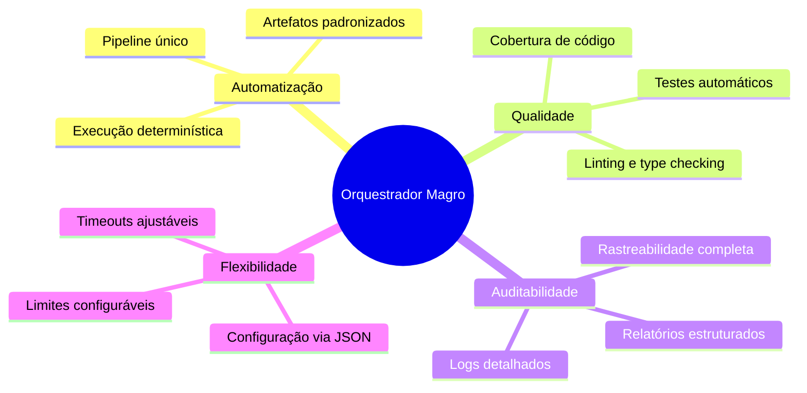
```mermaid
mindmap
  root((Orquestrador Magro))
    Automatização
      Pipeline único
      Artefatos padronizados
      Execução determinística
    Qualidade
      Testes automáticos
      Linting e type checking
      Cobertura de código
    Auditabilidade
      Logs detalhados
      Relatórios estruturados
      Rastreabilidade completa
    Flexibilidade
      Configuração via JSON
      Timeouts ajustáveis
      Limites configuráveis
```

---

## 🏗️ Arquitetura do Sistema

### Visão Geral da Arquitetura

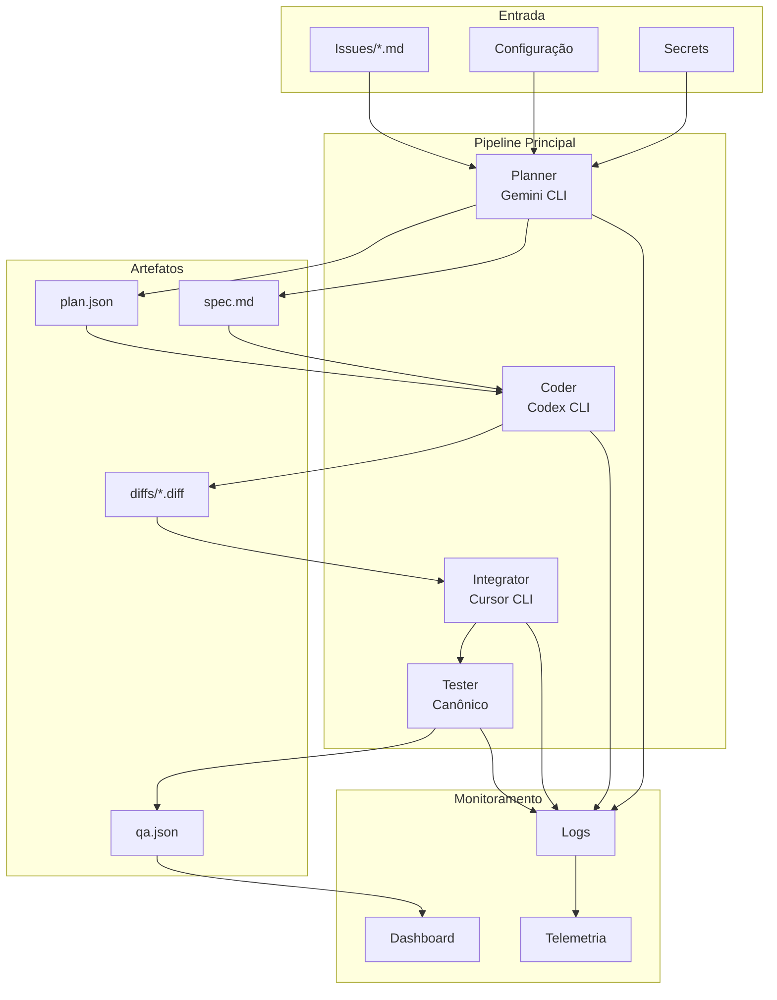
```mermaid
graph TB
    subgraph "Entrada"
        A[Issues/*.md]
        B[Configuração]
        C[Secrets]
    end
    
    subgraph "Pipeline Principal"
        D[Planner<br/>Gemini CLI]
        E[Coder<br/>Codex CLI]
        F[Integrator<br/>Cursor CLI]
        G[Tester<br/>Canônico]
    end
    
    subgraph "Artefatos"
        H[plan.json]
        I[spec.md]
        J[diffs/*.diff]
        K[qa.json]
    end
    
    subgraph "Monitoramento"
        L[Logs]
        M[Dashboard]
        N[Telemetria]
    end
    
    A --> D
    B --> D
    C --> D
    D --> H
    D --> I
    H --> E
    I --> E
    E --> J
    J --> F
    F --> G
    G --> K
    D --> L
    E --> L
    F --> L
    G --> L
    K --> M
    L --> N
```

### Componentes da Arquitetura

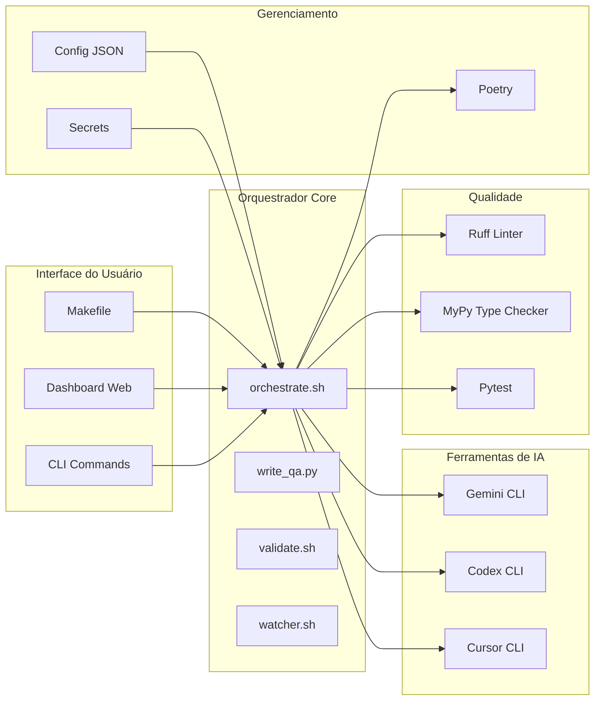
```mermaid
graph LR
    subgraph "Interface do Usuário"
        A[Makefile]
        B[Dashboard Web]
        C[CLI Commands]
    end
    
    subgraph "Orquestrador Core"
        D[orchestrate.sh]
        E[write_qa.py]
        F[validate.sh]
        G[watcher.sh]
    end
    
    subgraph "Ferramentas de IA"
        H[Gemini CLI]
        I[Codex CLI]
        J[Cursor CLI]
    end
    
    subgraph "Qualidade"
        K[Ruff Linter]
        L[MyPy Type Checker]
        M[Pytest]
    end
    
    subgraph "Gerenciamento"
        N[Poetry]
        O[Config JSON]
        P[Secrets]
    end
    
    A --> D
    B --> D
    C --> D
    D --> H
    D --> I
    D --> J
    D --> K
    D --> L
    D --> M
    D --> N
    O --> D
    P --> D
```

---

## 🔧 Componentes Principais

### 1. Planner (Gemini CLI)

**Função**: Analisa issues e gera planos estruturados

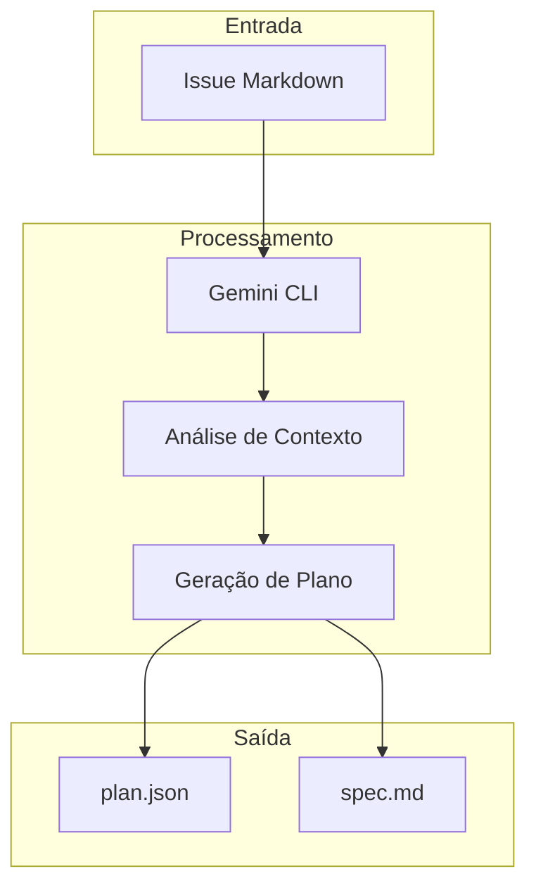
```mermaid
flowchart TD
    A[Issue Markdown] --> B[Gemini CLI]
    B --> C[Análise de Contexto]
    C --> D[Geração de Plano]
    D --> E[plan.json]
    D --> F[spec.md]
    
    subgraph "Entrada"
        A
    end
    
    subgraph "Processamento"
        B
        C
        D
    end
    
    subgraph "Saída"
        E
        F
    end
```

**Artefatos Gerados**:
- `plan.json`: Plano estruturado em JSON
- `spec.md`: Especificação técnica detalhada

### 2. Coder (Codex CLI)

**Função**: Gera código baseado no plano e especificação

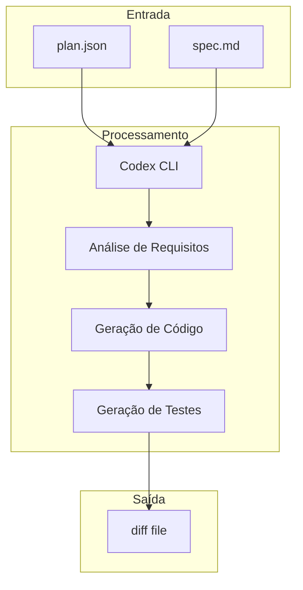
```mermaid
flowchart TD
    A[plan.json] --> B[Codex CLI]
    C[spec.md] --> B
    B --> D[Análise de Requisitos]
    D --> E[Geração de Código]
    E --> F[Geração de Testes]
    F --> G[diff file]
    
    subgraph "Entrada"
        A
        C
    end
    
    subgraph "Processamento"
        B
        D
        E
        F
    end
    
    subgraph "Saída"
        G
    end
```

### 3. Integrator (Cursor CLI)

**Função**: Aplica mudanças e executa build local

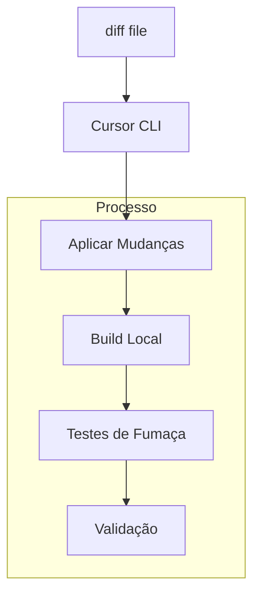
```mermaid
flowchart TD
    A[diff file] --> B[Cursor CLI]
    B --> C[Aplicar Mudanças]
    C --> D[Build Local]
    D --> E[Testes de Fumaça]
    E --> F[Validação]
    
    subgraph "Processo"
        C
        D
        E
        F
    end
```

### 4. Tester (Canônico)

**Função**: Executa testes automatizados e valida qualidade

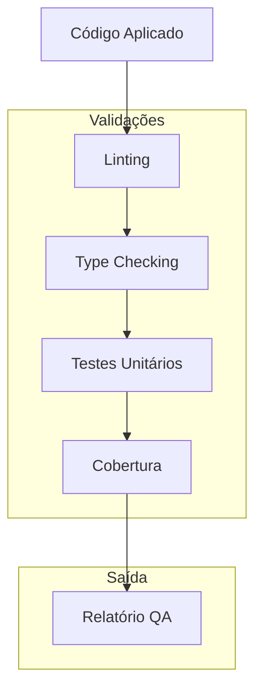
```mermaid
flowchart TD
    A[Código Aplicado] --> B[Linting]
    B --> C[Type Checking]
    C --> D[Testes Unitários]
    D --> E[Cobertura]
    E --> F[Relatório QA]
    
    subgraph "Validações"
        B
        C
        D
        E
    end
    
    subgraph "Saída"
        F
    end
```

---

## 🔄 Fluxo de Trabalho

### Pipeline Completo

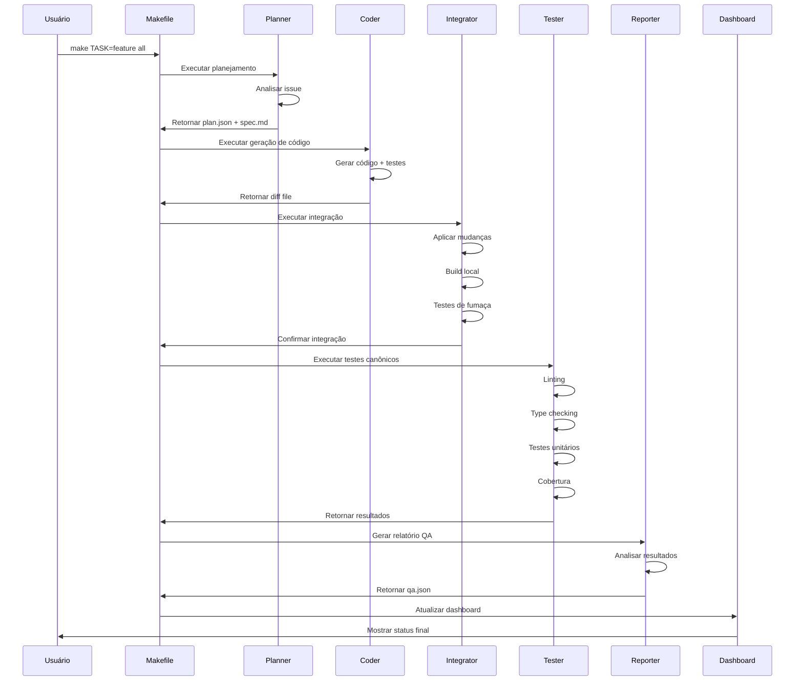
```mermaid
sequenceDiagram
    participant U as Usuário
    participant M as Makefile
    participant P as Planner
    participant C as Coder
    participant I as Integrator
    participant T as Tester
    participant R as Reporter
    participant D as Dashboard

    U->>M: make TASK=feature all
    M->>P: Executar planejamento
    P->>P: Analisar issue
    P->>M: Retornar plan.json + spec.md
    
    M->>C: Executar geração de código
    C->>C: Gerar código + testes
    C->>M: Retornar diff file
    
    M->>I: Executar integração
    I->>I: Aplicar mudanças
    I->>I: Build local
    I->>I: Testes de fumaça
    I->>M: Confirmar integração
    
    M->>T: Executar testes canônicos
    T->>T: Linting
    T->>T: Type checking
    T->>T: Testes unitários
    T->>T: Cobertura
    T->>M: Retornar resultados
    
    M->>R: Gerar relatório QA
    R->>R: Analisar resultados
    R->>M: Retornar qa.json
    
    M->>D: Atualizar dashboard
    D->>U: Mostrar status final
```

### Estados do Pipeline

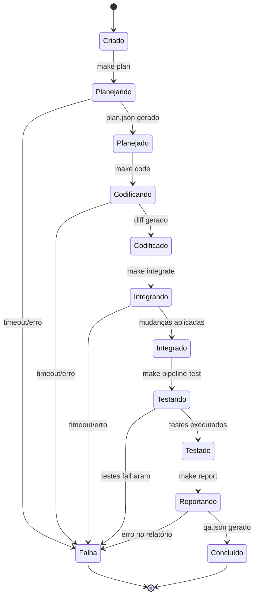
```mermaid
stateDiagram-v2
    [*] --> Criado
    Criado --> Planejando: make plan
    Planejando --> Planejado: plan.json gerado
    Planejado --> Codificando: make code
    Codificando --> Codificado: diff gerado
    Codificado --> Integrando: make integrate
    Integrando --> Integrado: mudanças aplicadas
    Integrado --> Testando: make pipeline-test
    Testando --> Testado: testes executados
    Testado --> Reportando: make report
    Reportando --> Concluído: qa.json gerado
    
    Planejando --> Falha: timeout/erro
    Codificando --> Falha: timeout/erro
    Integrando --> Falha: timeout/erro
    Testando --> Falha: testes falharam
    Reportando --> Falha: erro no relatório
    
    Falha --> [*]
    Concluído --> [*]
```

---

## 🎭 Dashboard

### Arquitetura do Dashboard

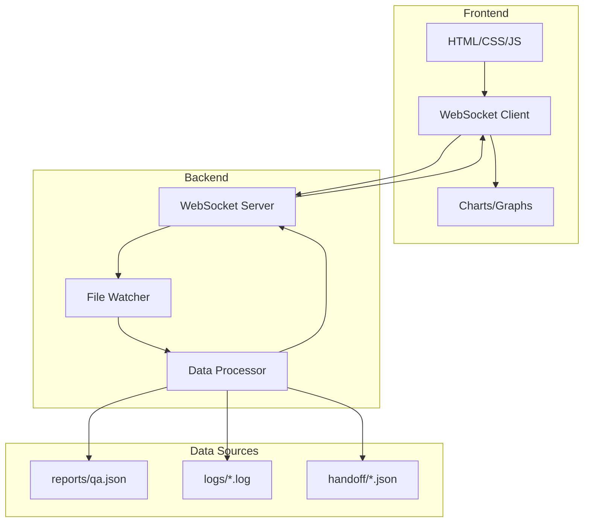
```mermaid
graph TB
    subgraph "Frontend"
        A[HTML/CSS/JS]
        B[WebSocket Client]
        C[Charts/Graphs]
    end
    
    subgraph "Backend"
        D[WebSocket Server]
        E[File Watcher]
        F[Data Processor]
    end
    
    subgraph "Data Sources"
        G[reports/qa.json]
        H[logs/*.log]
        I[handoff/*.json]
    end
    
    A --> B
    B --> D
    D --> E
    E --> F
    F --> G
    F --> H
    F --> I
    F --> D
    D --> B
    B --> C
```

### Funcionalidades do Dashboard

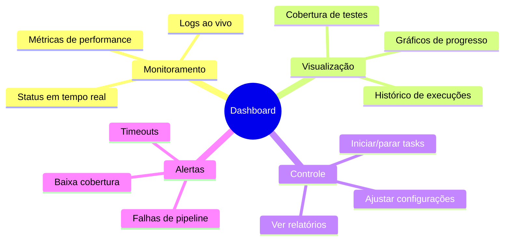
```mermaid
mindmap
  root((Dashboard))
    Monitoramento
      Status em tempo real
      Logs ao vivo
      Métricas de performance
    Visualização
      Gráficos de progresso
      Histórico de execuções
      Cobertura de testes
    Controle
      Iniciar/parar tasks
      Ajustar configurações
      Ver relatórios
    Alertas
      Falhas de pipeline
      Timeouts
      Baixa cobertura
```

### Fluxo de Dados do Dashboard

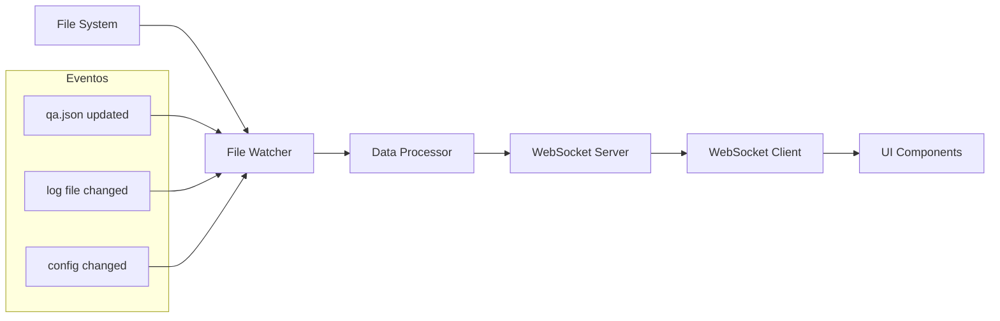
```mermaid
flowchart LR
    A[File System] --> B[File Watcher]
    B --> C[Data Processor]
    C --> D[WebSocket Server]
    D --> E[WebSocket Client]
    E --> F[UI Components]
    
    subgraph "Eventos"
        G[qa.json updated]
        H[log file changed]
        I[config changed]
    end
    
    G --> B
    H --> B
    I --> B
```

---

## ⚙️ Configuração

### Estrutura de Configuração

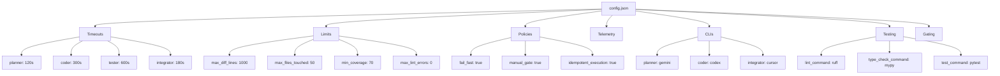
```mermaid
graph TD
    A[config.json] --> B[Timeouts]
    A --> C[Limits]
    A --> D[Policies]
    A --> E[Telemetry]
    A --> F[CLIs]
    A --> G[Testing]
    A --> H[Gating]
    
    B --> B1[planner: 120s]
    B --> B2[coder: 300s]
    B --> B3[tester: 600s]
    B --> B4[integrator: 180s]
    
    C --> C1[max_diff_lines: 1000]
    C --> C2[max_files_touched: 50]
    C --> C3[min_coverage: 70]
    C --> C4[max_lint_errors: 0]
    
    D --> D1[fail_fast: true]
    D --> D2[manual_gate: true]
    D --> D3[idempotent_execution: true]
    
    F --> F1[planner: gemini]
    F --> F2[coder: codex]
    F --> F3[integrator: cursor]
    
    G --> G1[lint_command: ruff]
    G --> G2[type_check_command: mypy]
    G --> G3[test_command: pytest]
```

### Configuração de CLIs

```mermaid
flowchart TD
    A[CLI Configuration] --> B[Planner CLI]
    A --> C[Coder CLI]
    A --> D[Integrator CLI]
    
    B --> B1[Command: gemini]
    B --> B2[Args: plan --in {issue}]
    B --> B3[Output: plan.json, spec.md]
    
    C --> C1[Command: codex]
    C --> C2[Args: code --plan {plan}]
    C --> C3[Output: diff file]
    
    D --> D1[Command: cursor]
    D --> D2[Args: apply --from-diff {diff}]
    D --> D3[Output: applied changes]
```

---

## 🖥️ Comandos e Interface

### Interface Makefile

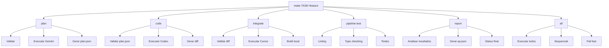
```mermaid
graph TD
    A[make TASK=feature] --> B[plan]
    A --> C[code]
    A --> D[integrate]
    A --> E[pipeline-test]
    A --> F[report]
    A --> G[all]
    
    B --> B1[Validar]
    B --> B2[Executar Gemini]
    B --> B3[Gerar plan.json]
    
    C --> C1[Validar plan.json]
    C --> C2[Executar Codex]
    C --> C3[Gerar diff]
    
    D --> D1[Validar diff]
    D --> D2[Executar Cursor]
    D --> D3[Build local]
    
    E --> E1[Linting]
    E --> E2[Type checking]
    E --> E3[Testes]
    
    F --> F1[Analisar resultados]
    F --> F2[Gerar qa.json]
    F --> F3[Status final]
    
    G --> G1[Executar todos]
    G --> G2[Sequencial]
    G --> G3[Fail fast]
```

### Comandos de Desenvolvimento

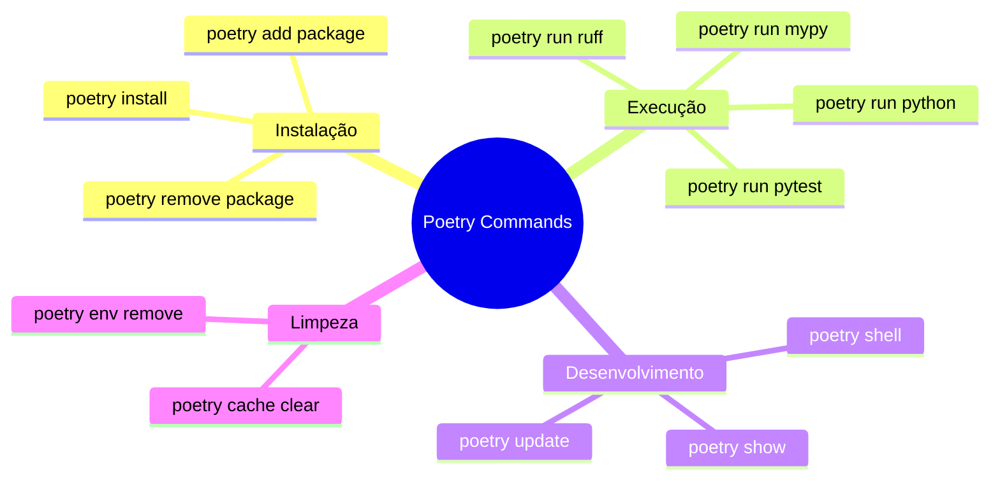
```mermaid
mindmap
  root((Poetry Commands))
    Instalação
      poetry install
      poetry add package
      poetry remove package
    Execução
      poetry run python
      poetry run pytest
      poetry run ruff
      poetry run mypy
    Desenvolvimento
      poetry shell
      poetry show
      poetry update
    Limpeza
      poetry cache clear
      poetry env remove
```

### Comandos de Monitoramento

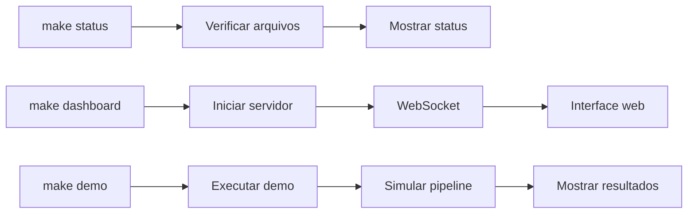
```mermaid
flowchart LR
    A[make status] --> B[Verificar arquivos]
    B --> C[Mostrar status]
    
    D[make dashboard] --> E[Iniciar servidor]
    E --> F[WebSocket]
    F --> G[Interface web]
    
    H[make demo] --> I[Executar demo]
    I --> J[Simular pipeline]
    J --> K[Mostrar resultados]
```

---

## 📊 Monitoramento e Telemetria

### Sistema de Logs

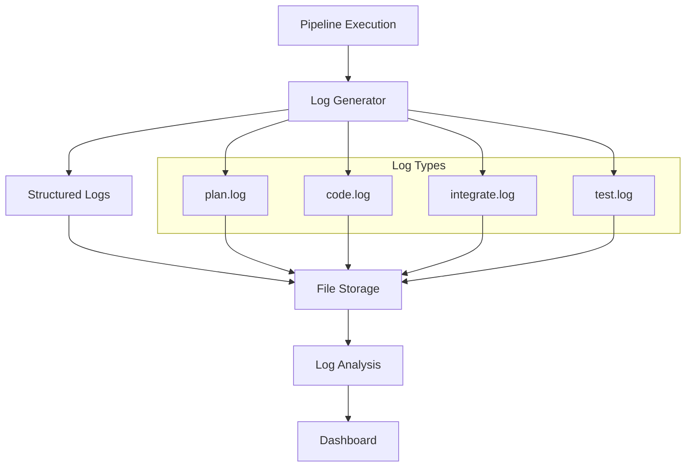
```mermaid
graph TB
    A[Pipeline Execution] --> B[Log Generator]
    B --> C[Structured Logs]
    C --> D[File Storage]
    D --> E[Log Analysis]
    E --> F[Dashboard]
    
    subgraph "Log Types"
        G[plan.log]
        H[code.log]
        I[integrate.log]
        J[test.log]
    end
    
    B --> G
    B --> H
    B --> I
    B --> J
    
    G --> D
    H --> D
    I --> D
    J --> D
```

### Telemetria e Métricas

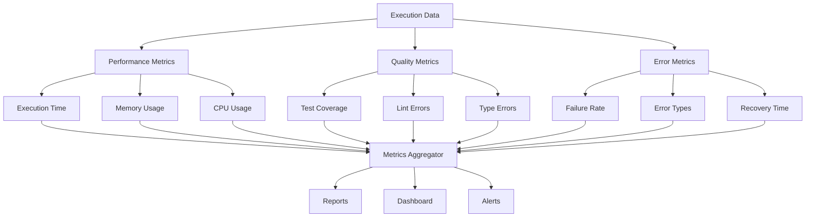
```mermaid
flowchart TD
    A[Execution Data] --> B[Performance Metrics]
    A --> C[Quality Metrics]
    A --> D[Error Metrics]
    
    B --> B1[Execution Time]
    B --> B2[Memory Usage]
    B --> B3[CPU Usage]
    
    C --> C1[Test Coverage]
    C --> C2[Lint Errors]
    C --> C3[Type Errors]
    
    D --> D1[Failure Rate]
    D --> D2[Error Types]
    D --> D3[Recovery Time]
    
    B1 --> E[Metrics Aggregator]
    B2 --> E
    B3 --> E
    C1 --> E
    C2 --> E
    C3 --> E
    D1 --> E
    D2 --> E
    D3 --> E
    
    E --> F[Reports]
    E --> G[Dashboard]
    E --> H[Alerts]
```

### Relatórios de Qualidade

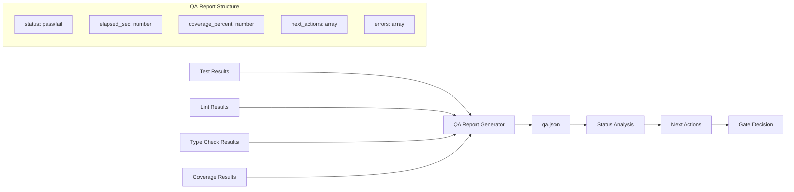
```mermaid
graph LR
    A[Test Results] --> B[QA Report Generator]
    C[Lint Results] --> B
    D[Type Check Results] --> B
    E[Coverage Results] --> B
    
    B --> F[qa.json]
    F --> G[Status Analysis]
    G --> H[Next Actions]
    H --> I[Gate Decision]
    
    subgraph "QA Report Structure"
        J[status: pass/fail]
        K[elapsed_sec: number]
        L[coverage_percent: number]
        M[next_actions: array]
        N[errors: array]
    end
```

---

## 🚨 Troubleshooting

### Diagnóstico de Problemas

```mermaid
flowchart TD
    A[Pipeline Failed] --> B{Check Logs}
    B --> C[plan.log]
    B --> D[code.log]
    B --> E[integrate.log]
    B --> F[test.log]
    
    C --> G{Planner Error?}
    G --> H[Check CLI]
    G --> I[Check Timeout]
    G --> J[Check Issue Format]
    
    D --> K{Coder Error?}
    K --> L[Check CLI]
    K --> M[Check Plan Format]
    K --> N[Check Timeout]
    
    E --> O{Integrator Error?}
    O --> P[Check CLI]
    O --> Q[Check Diff Size]
    O --> R[Check Build]
    
    F --> S{Tester Error?}
    S --> T[Check Dependencies]
    S --> U[Check Test Code]
    S --> V[Check Coverage]
    
    H --> W[Solution Applied]
    I --> W
    J --> W
    L --> W
    M --> W
    N --> W
    P --> W
    Q --> W
    R --> W
    T --> W
    U --> W
    V --> W
```

### Problemas Comuns

```mermaid
mindmap
  root((Common Issues))
    CLI Problems
      CLI not found
      CLI timeout
      CLI authentication
    Configuration
      Invalid JSON
      Missing secrets
      Wrong paths
    Dependencies
      Poetry not installed
      Dependencies missing
      Version conflicts
    Performance
      Timeout issues
      Memory problems
      Slow execution
    Quality Gates
      Low coverage
      Lint errors
      Type errors
```

### Soluções Rápidas

```mermaid
flowchart LR
    A[Quick Fixes] --> B[CLI Issues]
    A --> C[Config Issues]
    A --> D[Dependency Issues]
    
    B --> B1[Install CLI]
    B --> B2[Check PATH]
    B --> B3[Update CLI]
    
    C --> C1[Validate JSON]
    C --> C2[Check Secrets]
    C --> C3[Fix Paths]
    
    D --> D1[poetry install]
    D --> D2[poetry update]
    D --> D3[Clear cache]
```

---

## 🎯 Casos de Uso

### Caso de Uso 1: Nova Feature

```mermaid
sequenceDiagram
    participant Dev as Developer
    participant S as System
    participant AI as AI Tools
    participant Q as Quality Gates

    Dev->>S: Create issue.md
    Dev->>S: make TASK=feature all
    S->>AI: Execute planner
    AI->>S: Return plan.json
    S->>AI: Execute coder
    AI->>S: Return code diff
    S->>AI: Execute integrator
    AI->>S: Apply changes
    S->>Q: Run quality checks
    Q->>S: Return results
    S->>Dev: Show final status
```

### Caso de Uso 2: Bug Fix

```mermaid
flowchart TD
    A[Identify Bug] --> B[Create Bug Issue]
    B --> C[Describe Problem]
    C --> D[Add Reproduction Steps]
    D --> E[Execute Pipeline]
    E --> F[AI Analyzes Bug]
    F --> G[AI Generates Fix]
    G --> H[Apply Fix]
    H --> I[Test Fix]
    I --> J[Verify Resolution]
    J --> K[Deploy Fix]
```

### Caso de Uso 3: Refactoring

```mermaid
graph LR
    A[Identify Code Smell] --> B[Create Refactor Issue]
    B --> C[Describe Current State]
    C --> D[Define Target State]
    D --> E[Execute Pipeline]
    E --> F[AI Analyzes Code]
    F --> G[AI Generates Refactor]
    G --> H[Apply Changes]
    H --> I[Run Tests]
    I --> J[Verify Behavior]
    J --> K[Update Documentation]
```

### Caso de Uso 4: Performance Optimization

```mermaid
flowchart TD
    A[Performance Issue] --> B[Profile Code]
    B --> C[Identify Bottleneck]
    C --> D[Create Optimization Issue]
    D --> E[Describe Current Performance]
    E --> F[Define Target Performance]
    F --> G[Execute Pipeline]
    G --> H[AI Analyzes Performance]
    H --> I[AI Generates Optimization]
    I --> J[Apply Optimization]
    J --> K[Measure Improvement]
    K --> L[Verify No Regressions]
```

---

## 📈 Melhores Práticas

### Escrita de Issues

```mermaid
mindmap
  root((Issue Best Practices))
    Estrutura
      Contexto claro
      Objetivo específico
      Escopo bem definido
      Critérios mensuráveis
    Conteúdo
      Descrição detalhada
      Exemplos de uso
      Casos de teste
      Limitações conhecidas
    Qualidade
      Revisão antes de executar
      Validação de formato
      Verificação de completude
```

### Configuração de Pipeline

```mermaid
flowchart LR
    A[Pipeline Config] --> B[Timeouts]
    A --> C[Limits]
    A --> D[Quality Gates]
    
    B --> B1[Realistic timeouts]
    B --> B2[Account for complexity]
    B --> B3[Monitor performance]
    
    C --> C1[Reasonable diff limits]
    C --> C2[File count limits]
    C --> C3[Coverage thresholds]
    
    D --> D1[Zero lint errors]
    D --> D2[Zero type errors]
    D --> D3[Minimum coverage]
```

### Monitoramento Contínuo

```mermaid
graph TB
    A[Continuous Monitoring] --> B[Metrics Collection]
    B --> C[Performance Tracking]
    B --> D[Quality Tracking]
    B --> E[Error Tracking]
    
    C --> C1[Execution Time]
    C --> C2[Success Rate]
    C --> C3[Resource Usage]
    
    D --> D1[Coverage Trends]
    D --> D2[Error Rates]
    D --> D3[Quality Scores]
    
    E --> E1[Error Types]
    E --> E2[Recovery Time]
    E --> E3[Root Causes]
    
    C1 --> F[Dashboard]
    C2 --> F
    C3 --> F
    D1 --> F
    D2 --> F
    D3 --> F
    E1 --> F
    E2 --> F
    E3 --> F
```

---

## 🔗 Recursos Adicionais

### Documentação Técnica

- **README.md**: Visão geral do projeto
- **USAGE.md**: Guia de uso prático
- **pyproject.toml**: Configuração do Poetry
- **orchestrator/config.json**: Configuração do pipeline

### Ferramentas Relacionadas

- **Poetry**: Gerenciamento de dependências Python
- **Ruff**: Linter rápido para Python
- **MyPy**: Type checker para Python
- **Pytest**: Framework de testes
- **WebSockets**: Comunicação em tempo real

### Comunidade e Suporte

- **Issues**: Reportar bugs e solicitar features
- **Documentação**: Guias e tutoriais
- **Exemplos**: Casos de uso práticos
- **Dashboard**: Monitoramento em tempo real

---

## 📝 Conclusão

O Orquestrador "Magro" oferece uma solução completa para automatizar o desenvolvimento de software usando IA. Com sua arquitetura modular, configuração flexível e monitoramento abrangente, ele permite que equipes de desenvolvimento se concentrem em problemas complexos enquanto automatiza tarefas repetitivas.

### Próximos Passos

1. **Configurar o ambiente** seguindo o guia de instalação
2. **Criar uma issue de teste** usando o template
3. **Executar o pipeline completo** para familiarização
4. **Explorar o dashboard** para monitoramento
5. **Personalizar configurações** conforme necessidades
6. **Integrar com workflow** da equipe

Para dúvidas ou suporte, consulte a documentação ou abra uma issue no repositório.
